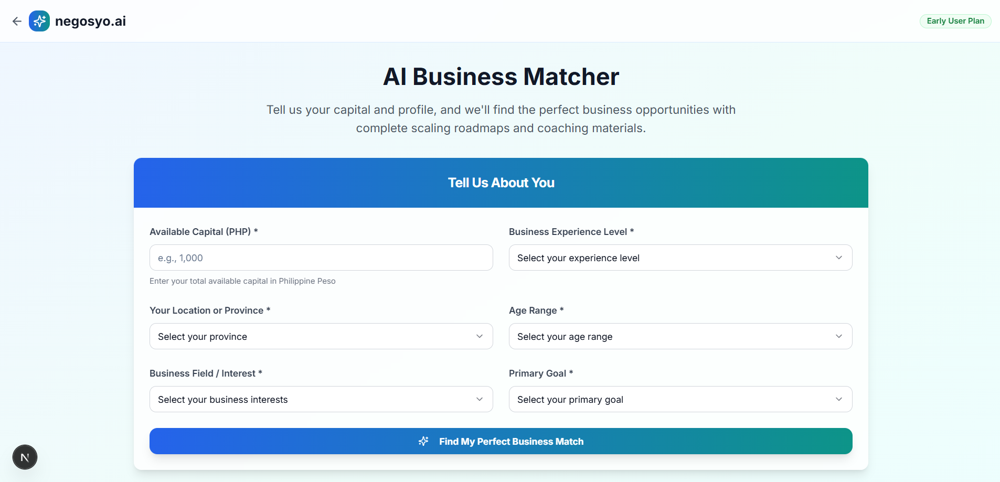
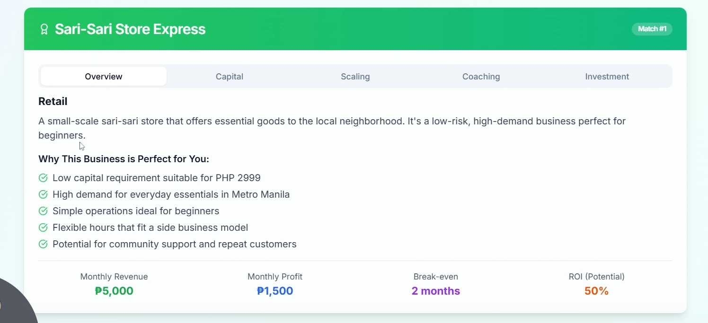

# NegosyoAI

Negosyo AI is a Next.js-based web application that helps users generate business plans, match business ideas, and more, powered by [BPxAI](https://bpxai.com), OpenAI and Supabase.

## Demo

https://www.loom.com/share/bcf61ddc1fa64835a615c33a047811c4?sid=99d6fdc6-c818-4a17-888d-776113cc5790





## Features

- AI-powered business plan generation
- Business idea matching
- Comprehensive planning tools
- User authentication
- Modern UI with Radix UI and Tailwind CSS

## Tech Stack

- Next.js
- React
- Tailwind CSS
- Supabase
- OpenAI API

## Getting Started

### 1. Clone the repository

```bash
git clone <repo-url>
cd negosyo-ai
```

### 2. Install dependencies

```bash
pnpm install
```

### 3. Set up environment variables

Copy `.env.sample` to `.env.local` and fill in your own API keys:

```bash
cp env.sample .env.local
```

Edit `.env.local` and provide values for:

- `NEXT_PUBLIC_SUPABASE_URL`
- `NEXT_PUBLIC_SUPABASE_ANON_KEY`
- `OPENAI_API_KEY`

You can get your Supabase keys from your [Supabase project dashboard](https://app.supabase.com/), and your OpenAI API key from [OpenAI](https://platform.openai.com/account/api-keys).

### 4. Run the development server

```bash
pnpm dev
```

Visit [http://localhost:3000](http://localhost:3000) to view the app.

## Available Scripts

- `pnpm dev` — Start the development server
- `pnpm build` — Build for production
- `pnpm start` — Start the production server
- `pnpm lint` — Run linter

## Contacts

- Koleen Paunon - https://koleenbp.com
- BPxAI - bpxailabs@gmail.com

## License

MIT
